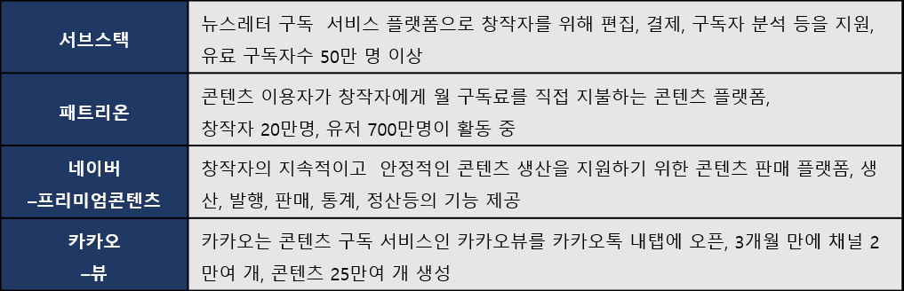
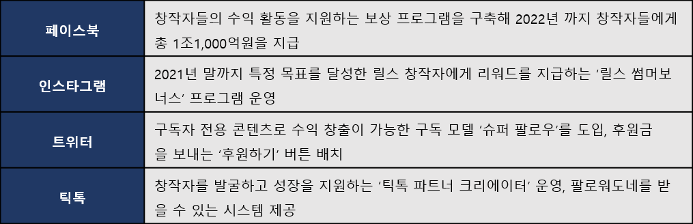

# 2.1. 디지털 창작자의 공유 경제

디지털 창작자 이코노미가 부상하게 된 배경과 이로 인해 달라진 콘텐츠 창작자 생태계를 살펴보겠습니다.&#x20;

전 세계의 콘텐츠 창작자는 유튜브 등의 플랫폼을 활용하여 창의성을 표현하고 디지털 커뮤니티에 지식 콘텐츠와 기술을 공유해 지역 경제에 기여하는 비즈니스를 만들고 있습니다. 오픈 소스 플랫폼에서는 나누고 싶은 아이디어나 열정, 지식이 있는 사람이라면 누구나 사용할 수 있기 때문에 다양하고 알려지지 않는 재능을 인정받을 수 있습니다.&#x20;

플랫폼 환경에서 콘텐츠 창작자는 생산의 활동으로 SNS 플랫폼에 트래픽과 광고 수익을 가져다주었지만 정적 콘텐츠 창작자에게 돌아오는 보상은 없었습니다. 기존 보상 체제에 불만을 품은 창작자들을 SNS 플랫폼을 벗어나 창작에 대한 보상을 받을 수 있는 곳인 서브스택, 패트리온, 네이버-프리미엄콘텐츠, 카카오-뷰 등으로 이동하기 시작했습니다. &#x20;

#### 창작에 대한 보상을 받을 수 있는 플랫폼

창작자들의 이탈 움직임이 보이자 SNS 플랫폼에서는 창작자를 잡아두기 위해 지원과 보상안을 앞다퉈 내놓았습니다. 2021년 상반기 동안 플랫폼 기업들이 창작자를 지원한 금액은 총 13억 달러로, 이는 2020년 한 해의 지원금보다 3배나 큰 금액입니다. (CBInsight. USA, 2021)&#x20;

#### 플랫폼 기업들의 창작자 지원 제도

보상제도가 갖추어진 공유 경제는 창작자에게만 수익을 가져다주는 것뿐만이 아니라 다양한 형태로 사회에 경제적 영향을 미칩니다. 광고와 로열티로 등 플랫폼 내의 창작자 측으로 흘러가는 직접적인 수익, 창작자가 음향 및 촬영 장비 등 콘텐츠 제작과정에서 필요한 제품 및 서비스를 구매하는 간접적 경제 효과, 창작자가 콘텐츠 내에서 제품이나 서비스를 홍보해 실제 매출이 증가하는 '오프 플랫폼'상의 유도적 영향 등이 포함됩니다.&#x20;

금전적인 측면과 아울러 사회적으로도 다양한 효과를 가져왔습니다. 각기 다른 관점과 성향을 가진 생산자가 만든 콘텐츠 속에는 기존 매체에 노출되지 않은 숨겨진 인재, 상품, 서비스가 등장하여 대중에게 노출되는가 하면 소비자 개인화된 취향에 부합하는 콘텐츠로 접근하여 다양한 사람들의 기호와 지적 호기심을 만족시켜주었습니다. &#x20;
