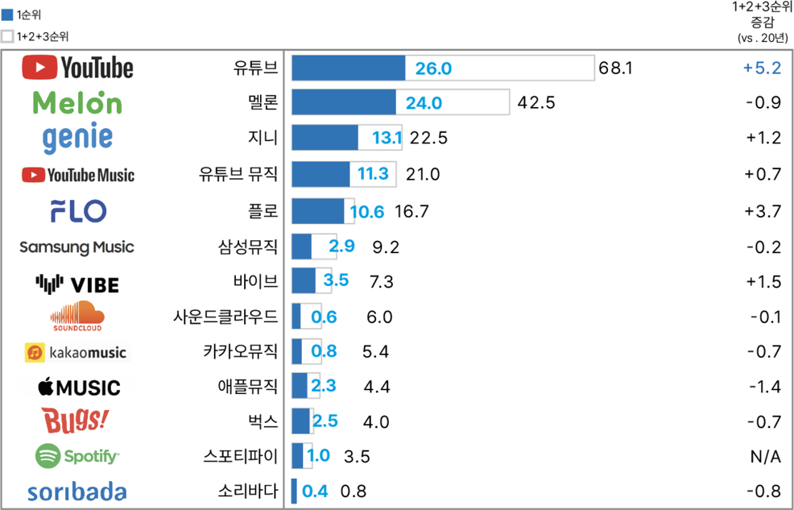

# 2.2. 음악 산업과 Pain Point

국내 Major사 음악 서비스는 Melon, Gennie, Flo , Bugs로 볼 수 있으며, 음원 콘텐츠 서비스 이용률 순위는 다음과 같습니다.

대부분의 음악 서비스 주요 IA(Information Architecture)는 신규 음악, 장르 음악, 시대별 음악, 스테이션 등으로 볼 수 있습니다. 하루에도 신규 음악이 500개 이상이 발매되는데, 플랫폼에서 네트워크 규칙과 콘텐츠의 흐름은 중앙 집권적 조직이 관리하며 각 서비스 사는 아이돌 중심 또는 협의/소속된 기획사 중심으로 신규 음악을 게시합니다. 안타깝게도 비주류 음악은 사용자에게 평가되기도 전에 노출이나 경험의 기회조차 갖지 못하고 Digital Data로만 남겨집니다. 스테이션의 경우, 내부 운영자들이 아이돌/셀럽을 중심으로 독점 선곡하여 제공하며 이는 편협되고 공정하지 않은 서비스입니다.

상대적으로, 유튜브에서는 수많은 사용자의 사용 및 청취 데이터를 기반으로 추천 알고리즘을 개발하여 서비스 화면을 구성합니다. 사용자는 유튜브와 유튜브 뮤직을 이용하는 주요 이유로 ＇내게 맞는 음악 추천을 잘 해줘서＇를 답했습니다. (Content Trend Report 2021, Open Survey) 눈여겨볼 점은 유튜브에는 주제와 취향에 맞게 음악을 선곡하여 하나의 동영상으로 음악 스트리밍 스테이션을 공유하는 창작자가 존재한다는 것입니다.&#x20;

최근까지도 음악 서비스 사는 스트리밍/다운로드 매출에 대한 저작권(인접권, 저작권, 실연권)을 지불했지만 스테이션을 제공한 개인에게는 적절한 보상을 제공하지 않습니다. 음악 서비스 사는 플랫폼에 트래픽을 발생시키는 커뮤니티 및 콘텐츠 창작자로부터 상당한 수익을 창출하였으며 지금껏 수익의 대부분은 그 시스템을 관리하는 중앙 집권적 조직에 집중되어왔습니다. 즉, 창작자 입장에서 스테이션을 제작하고 보상받는 시스템이 미흡한 것입니다. 개인 창작자는 플랫폼 내에서 적극적으로 콘텐츠를 만들고 활동할 동기부여를 받지 못하여 자발적인 창작이 이루어지지 않습니다.

다행스럽게도 콘텐츠 창작자에게 보상하는 제도를 도입하거나 강화중인는 서비스가 있으며  YouTube와 Spotify가 대표적입니다 . 이들은 각각 세계 최대 동영상 플랫폼과 시장 점유율 1위인 음악 스트리밍 서비스입니다. YouTube나 Spotify 같은 플랫폼에서는 수억, 수십억 명의 사용자들이 모여 상호 작용하고 콘텐츠를 생성 • 공유 • 소비합니다. YouTube에서 적절한 보상이 영상 창작자에게 제공되기에 끊임없이 새로운 콘텐츠가 등장하고 많은 이용자가 스트리밍합니다. inDJ 프로젝트팀은  활성화된 서비스 사례를 참고하는 것에 그치지 않고 지속가능한 Token Economy를 구축하여 콘텐츠 창작자와 콘텐츠 소비자 모두 만족하는 플랫폼 세계를 지향 합니다.  &#x20;

『스테이션』 : 재생목록을 칭하는 단어로 원하는 음악을 따로 담아서 재생할 수 있음
