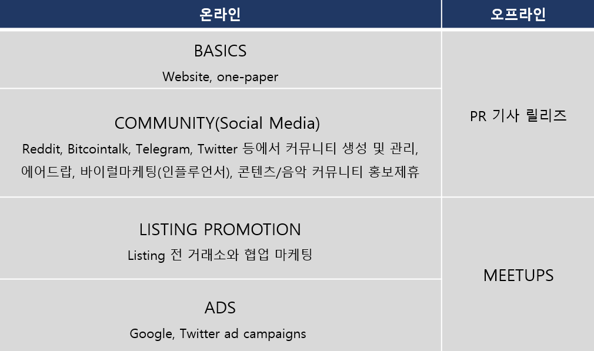

# 4.3. 마케팅 전략

전 세계적으로 수많은 블록체인 및 암호화폐 신생기업이 등장하고 있으며 그 가치가 높은 곳은 수조 원에 달한 정도로 성장이 가속화되고 있습니다.&#x20;

급격한 성장으로 업계 내 마케팅 경쟁 또한 크게 심화함에 따라, 대중에게 inDJ 프로젝트를 마케팅할 수 있는 혁신적인 방법을 고민하였습니다. InDJ 프로젝트 팀은 시장에 맞는 inDJ만의 맞춤형 암호화폐 마케팅 전략을 개발하고 실행하는 것이 프로젝트 및 코인의 생존과 성장에 중요하다는 것을 명확히 인지하고 있습니다.&#x20;

InDJ 프로젝트는 온 • 오프 통합 마케팅 계획을 진행 중이며, 특히 디지털 콘텐츠와 음악에 관심 있는 커뮤니티까지 확대하여 inDJ Token Economy를 Promotion 합니다.&#x20;

주요 마케팅 채널은 다음과 같습니다.

 (1).png>)
