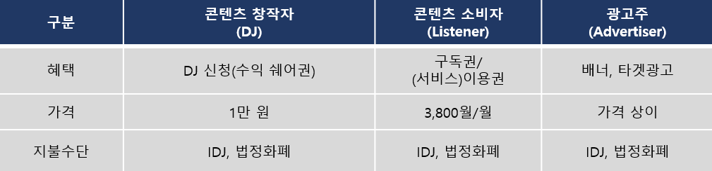
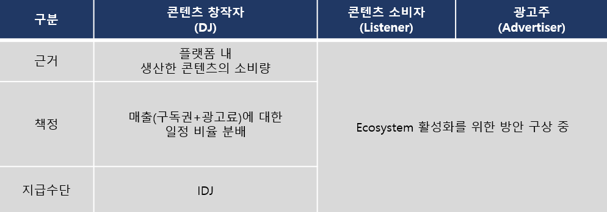

# Business Model

inDJ 프로젝트 수익 모델은 B2B와 B2C를 기반으로 하며 주요 결제 수단은 인디토큰(IDJ)입니다. 이러한 Token Economy 조성은 콘텐츠 창작자와 소비자 환경의 생태계를 투명하고 공정하게 만드는 데 의의가 있습니다.

InDJ 프로젝트는 경제 주체자로 콘텐츠 창작자(DJ)와 콘텐츠 소비자(Listener), 광고주(Advertiser)가 있으며, 이들로부터 얻을 수 있는 세 가지의 수입원이 존재합니다.&#x20;

#### InDJ 플랫폼 주수입

#### 인디코인(IDJ) 획득 방법

